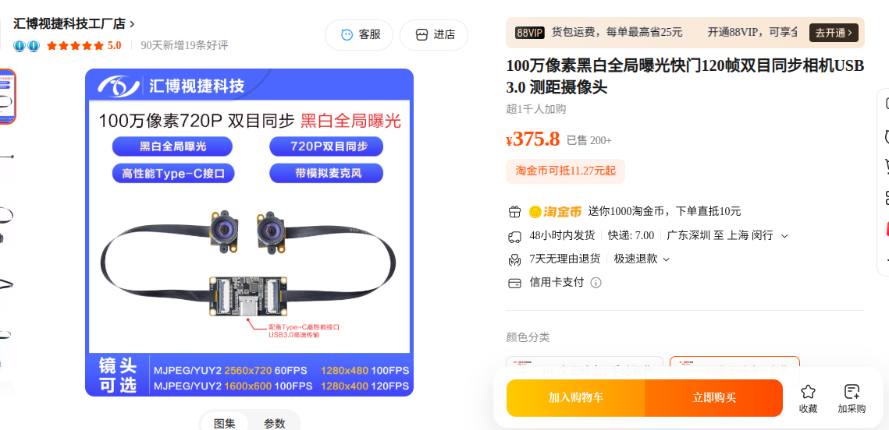
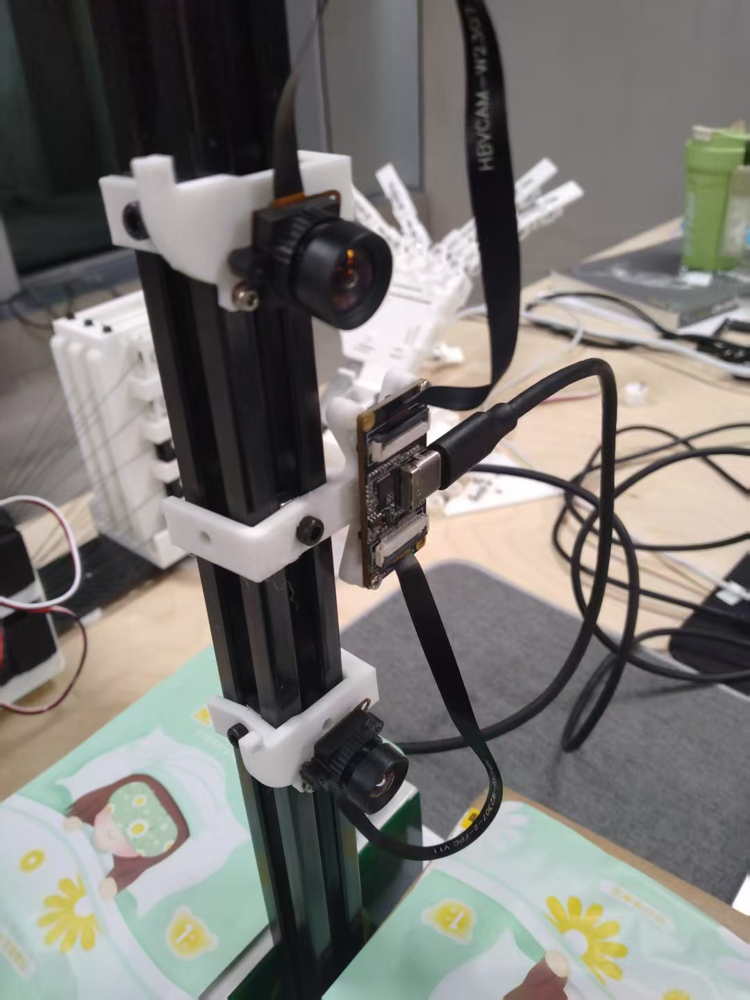

# MultiView Hand Capture
Stereo Camera Hand Tracking & Calibration with MediaPipe + OpenCV

## 📖 Introduction

MultiViewHandCapture is a Python project for real-time stereoscopic hand tracking using two synchronized camera streams (left and right eye images from a stereo camera).
It includes:

- Camera calibration tools for high-precision stereo setup
- Robust stereo camera testing
- Real-time 3D reconstruction of hand pose using MediaPipe Hands and OpenCV
- Finger bone length / angle limit calibration to produce more stable and realistic hand models

This project is designed for low-latency tracking, with threaded camera capture and optimized visualizations using Matplotlib.

## Hardware

You only need a stereo camera like [this](https://item.taobao.com/item.htm?abbucket=10&id=743230798887&mi_id=0000bwamz5ZMYErS1WTgKf9IdOl1ESCRqd82DVDK83dPOOA&ns=1&priceTId=2150408117645701455644197e1de5&skuId=5298428819307&spm=a21n57.1.hoverItem.13&utparam=%7B%22aplus_abtest%22%3A%2244a2c4e89250625a3c3a3487ebe963e3%22%7D&xxc=taobaoSearch) and a 3D-printed support.

<div align="center">
  
</div>


<div align="center">
  
</div>

## ⚙️ How It Works

### 1. Stereo Camera Calibration (calibrate.py)

- Uses a known checkerboard pattern (default: 9×6 squares, each 23.5 mm) viewed by both lenses.
- Detects corresponding points in both images.

Performs:
- Intrinsic calibration for each camera
- Stereo calibration to find rotation R, translation T between cameras
- Saves parameters (K1, K2, D1, D2, R, T) to stereo_params.json.

### 2. Camera Testing (test_camera.py)
- Opens the stereo camera feed in MJPG format for smoother performance.
- Displays left/right combined feed at reduced resolution for responsiveness.
- Prints FPS and handles dropped frames gracefully.

### 3. Configuration (config.py)
Central place for editable parameters.

### 4. Stereo Hand Tracking (track.py)
Initialization:
- Loads stereo parameters from stereo_params.json
Starts threaded stereo camera feed

Hand Detection:
- Runs MediaPipe Hands separately on left & right images
- Applies One Euro Filter to smooth landmarks while keeping motion responsiveness
3D Reconstruction:
- Undistorts 2D landmark positions in both images
Triangulates points in 3D using OpenCV’s cv2.triangulatePoints

Finger Length / Joint Angle Calibration:
- First 100 frames: measure average length of each finger bone
- Afterwards: correct detected geometry to match calibrated lengths & joint angle constraints

Visualization:
- Displays left/right camera views with hand overlays
Shows reconstructed 3D hand (front & side views) with Matplotlib
- Status text indicates “Calibration (x/y images needed)” or “Gesture Tracking”

## 🚀 Usage

1. Install dependencies
```
git clone https://github.com/StarCycle/MultiViewHandCapture
cd MultiViewHandCapture
pip install opencv-python numpy matplotlib mediapipe
```
2. Edit `config.py` to set the following parameters:
```
CAMERA_INDEX = 0              # Default camera device index
SINGLE_WIDTH  = 1280          # Width of one camera image
HEIGHT        = 720           # Height of one camera image
FULL_WIDTH    = SINGLE_WIDTH * 2  # Stereo image total width (e.g. 2560 for 1280x720 * 2)

# Calibration settings
BOARD_SIZE    = (9, 6)        # Checkerboard pattern size
SQUARE_SIZE   = 23.5          # Checkerboard square size in mm

# Calibration parameters
CALIBRATION_FRAMES = 100      # Number of frames for bone length calibration
```
3. Calibrate your stereo camera
First print this [checkerboard](./images/pattern.png) for calibration.
```
python calibrate.py
```
Note: Press C when both camera views show the complete checkerboard to capture. Minimum 10 images required.

4. Run Hand Tracking
```
python track.py
```
**Stage 1**: Calibration mode for first 100 frames (“Calibration (x/100 images needed)” shown in title).

**Stage 2**: Gesture tracking with corrected finger bone lengths.

## Limitations

- Your palm must be within the field of view of both cameras, and the palm should face the two cameras as squarely as possible to get better performance of mediapipe.
- The hand model is not optimized for low-latency tracking because of limited camera FPS and filtering needed for Meriapipe. It does not work well for very fast gestures. 